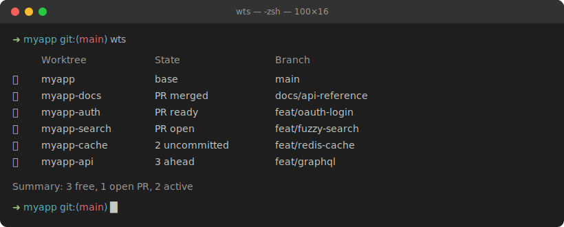

# wts

**Running several coding agents in parallel? See at a glance which git worktree is free for the next one.**

When you fan work out across multiple worktrees — one agent on a feature, another on a bugfix, a third waiting on review — it gets hard to track which trees are busy and which are safe to reuse. `wts` (worktree status) scans them all and shows a clean traffic-light status, so you know instantly where you can drop in fresh work without clobbering something in flight.



## Features

- Simple, fast, no dependencies beyond `git` (and optionally `gh`)
- Works with both regular checkouts and `git worktree`s
- Portable across **bash 3.2+** (including stock macOS `/bin/bash`)
- Supports `--json`, `--free-only`, `--no-color`
- PRs looked up per worktree branch in parallel — cost scales with your handful of worktrees, not the repo's total PR count (and never the slow `mergeable` field)
- Handles worktree paths with spaces and emits properly escaped JSON
- Emoji auto-disable when output isn't a terminal (e.g. piped into `grep`)
- Graceful degradation when GitHub CLI is not authenticated
- Zero state / no databases — pure git + gh

## Installation

### One-liner (recommended)

```bash
mkdir -p ~/bin
curl -fsSL https://raw.githubusercontent.com/pid1x/wts/main/wts > ~/bin/wts
chmod +x ~/bin/wts
```

Make sure `~/bin` is in your `PATH`. If it isn't yet, add it to your shell config:

```bash
# zsh (default on macOS)
echo 'export PATH="$HOME/bin:$PATH"' >> ~/.zshrc && source ~/.zshrc

# bash
echo 'export PATH="$HOME/bin:$PATH"' >> ~/.bashrc && source ~/.bashrc
```

### From source

```bash
git clone https://github.com/pid1x/wts.git
cd wts
ln -s "$(pwd)/wts" ~/bin/wts
```

## Usage

```bash
# Scan the current directory's repo
wts

# Show only available worktrees
wts --free-only        # or: wts -f

# Target a specific repository
wts --repo ~/projects/myapp    # or: wts -r ~/projects/myapp

# JSON output for scripts / tools
wts --json             # or: wts -j

# Disable colors/emoji
wts --no-color         # or: wts -n
```

### Command line options

| Flag                 | Description                              |
|----------------------|------------------------------------------|
| `-r`, `--repo PATH`  | Repository to scan (default = cwd)       |
| `-f`, `--free-only`  | Only show GREEN (available) worktrees    |
| `-j`, `--json`       | Output JSON instead of the table         |
| `-n`, `--no-color`   | Disable traffic light emoji and colors   |
| `-h`, `--help`       | Show help                                |

## Output

Each worktree is shown as: **icon · name · state · branch**.

### Icons

| Icon | Meaning                                      |
|------|----------------------------------------------|
| 🏠   | The base checkout (your main worktree)       |
| 🟢   | **Free** — ready for new work                |
| 🟡   | **Waiting** — open PR, not yet mergeable      |
| 🔴   | **Busy** — active changes or un-pushed work  |

### States

| State           | Icon | Meaning                                          |
|-----------------|------|--------------------------------------------------|
| `base`          | 🏠   | Main checkout, clean on the default branch        |
| `clean`         | 🟢   | Clean, nothing pending                            |
| `PR merged`     | 🟢   | PR merged — worktree is free to reuse             |
| `PR ready`      | 🟢   | Open PR, approved (ready to merge)                |
| `PR open`       | 🟡   | Open PR awaiting review                           |
| `N ahead`       | 🔴   | Clean, but `N` commits ahead of default, no PR    |
| `N uncommitted` | 🔴   | Dirty working tree (`N` changed files)            |

**Priority**: dirty → RED, then open PR (ready → GREEN, else YELLOW), then merged PR → GREEN, then ahead → RED, otherwise GREEN.

PR detection (`PR open` / `PR ready` / `PR merged`) requires authenticated `gh`. Without it, you still get accurate GREEN/RED from git alone.

## Performance

`wts` is built to stay fast even on large monorepos with many worktrees:

- Worktrees are classified **in parallel** — both the per-worktree `git status` and its PR lookup run concurrently, so wall-clock time is bounded by the slowest worktree, not the sum.
- Each worktree's PR is fetched with a **targeted `--head <branch>` query**, so the cost scales with your number of worktrees (a handful), not the repo's total PR count (which can be thousands). The slow `mergeable` field is never requested.

A live spinner shows progress while scanning (on an interactive terminal only).

If `gh` isn't installed or authenticated, PR lookups are skipped automatically and you still get full GREEN/RED detection from git alone.

## Requirements

- `git`
- `gh` (GitHub CLI) — **optional** but strongly recommended

Authenticate once with:

```bash
gh auth login
```

Without `gh` (or when not logged in), `wts` still works perfectly for RED/GREEN detection using only git.

## Example Workflows

### "Where can I start a new agent?"

```bash
wts --free-only
```

### Use in a script

```bash
FREE_WORKTREE=$(wts --free-only --json | jq -r '.[0].path' 2>/dev/null || true)
if [[ -n "$FREE_WORKTREE" ]]; then
  cd "$FREE_WORKTREE"
  # start your agent here...
fi
```

### Quick health check of all your active branches

```bash
wts
```

## Development

```bash
git clone https://github.com/pid1x/wts.git
cd wts

# Syntax validation (very important for portability)
bash -n wts

# Run the test suite (creates temp repos + mocks gh)
bash tests/wts_test.sh
```

The script is intentionally self-contained and can be sourced (the `main` function only runs when the file is executed directly).

### Testing philosophy

Tests use real temporary git repositories + a minimal `gh` mock so they run reliably without any GitHub credentials.

## Why wts?

Parallel AI coding agents (Grok, Cursor, Claude, etc.) make it cheap to spin up
many worktrees at once — one per task. The bottleneck becomes *you* keeping track
of them:

- Which tree is an agent still actively working in? (don't touch — 🔴 RED)
- Which one is done and just waiting on a PR review? (leave it — 🟡 YELLOW)
- Which one is clean and free for the next agent? (go — 🟢 GREEN)

Checking each one by hand (`git status`, `git log`, hunting for the PR) is slow and
error-prone, and starting a new agent in the wrong tree means lost or clobbered work.

`wts` answers all three questions for every worktree in a single command — and
`wts --free-only` gives you exactly the trees that are safe to reuse:

```bash
wts -f                 # just the GREEN ones, ready for a new agent
```

`wts` removes the guesswork.

## Contributing

1. Fork the repository
2. Create a feature branch
3. Make your change (keep it compatible with bash 3.2)
4. Add or update tests when appropriate
5. Open a Pull Request

Bug reports and ideas are very welcome!

## License

This project is licensed under the MIT License - see the [LICENSE](LICENSE) file for details.

---

**Happy worktree-ing!** 🧑‍💻
